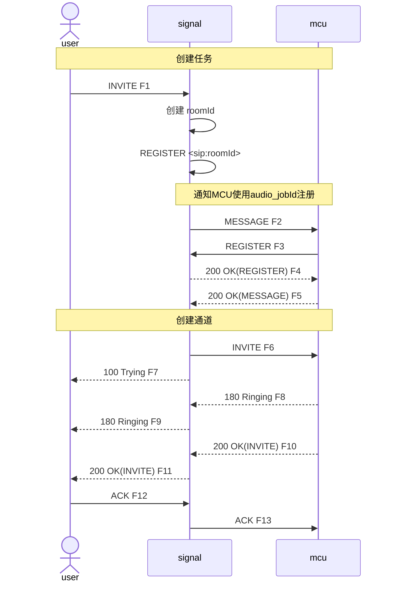
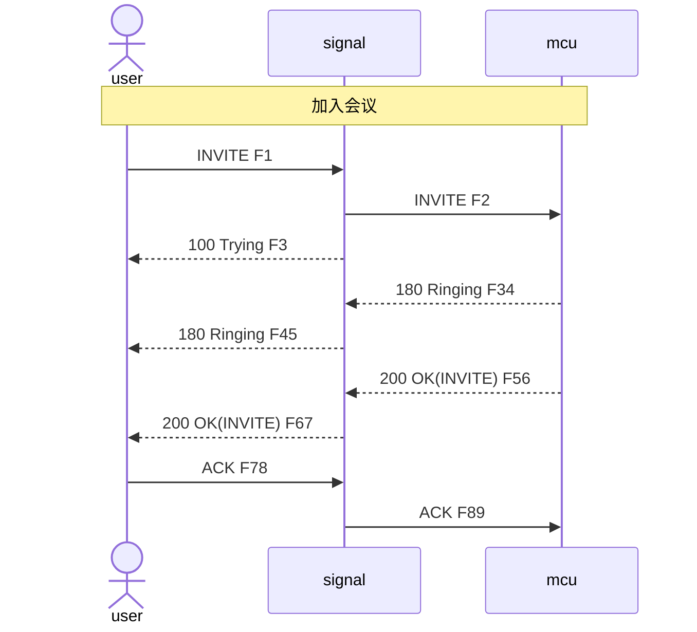
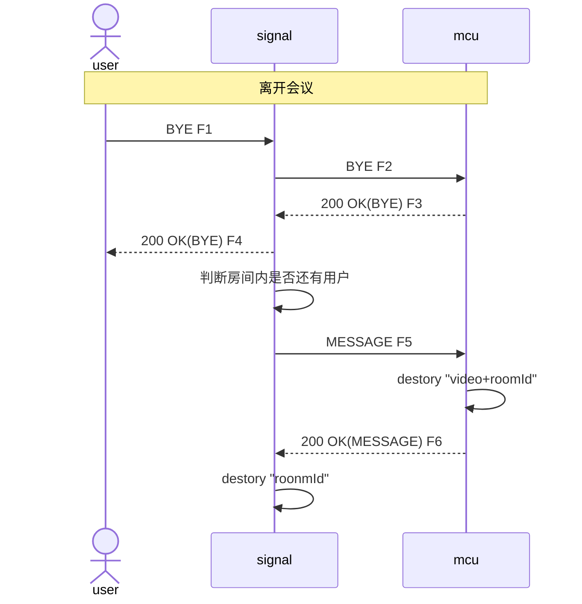

# SIP 改造方案

## 背景

在MCU现有版本的基础上，使用核心网中常见的SIP协议进行信令部分改造

## 目标

- 信令流程改用标准SIP协议实现，参考RFC3261

## 方案

- 创建任务使用`MESSAGE`和`REGISTER`实现。信令以jobId作为用户名注册信令任务账号，向MCU发送`MESSAGE`告知MCU以audio+jobId作为用户名注册MCU任务账号，同时提供音频编码格式和视频MCU回调账号，MCU成功处理后回复`200 OK`
- 添加通道使用`INVITE`实现，其中To为audio+jobId，From中的用户名作为channelId，MCU从sdp中获取payloadType、目的IP和端口。MCU成功处理后回复`180 Ringing`和`200 OK`
- 移除通道使用`BYE`实现，其中To为audio+jobId，From中的用户名作为channelId，用于区分通道。MCU成功处理后回复`200 OK`
- 开关麦克风均使用`INFO`实现，成功回复`200 OK`
- 结束任务使用`MESSAGE`实现成功回复`200 OK`

### 时序图

#### 创建会议

#### 加入会议

#### 离开会议

